# Thor Arquivista - Caixa de Ferramentas de Preservação Digital

Aplicativo desktop em Python para executar tarefas comuns de preservação digital: manifestos BagIt, verificação de fixidez, geração de pacote BagIt, cópia validada, backup preservacional BagIt, análise/tratamento de duplicatas, exclusão de duplicatas por manifesto e conversão PREMIS.

O aplicativo usa Tkinter com `ttkbootstrap`, executa tarefas em fila local e grava o estado em arquivos JSON na própria pasta do projeto. A janela principal abre centralizada no monitor ativo.

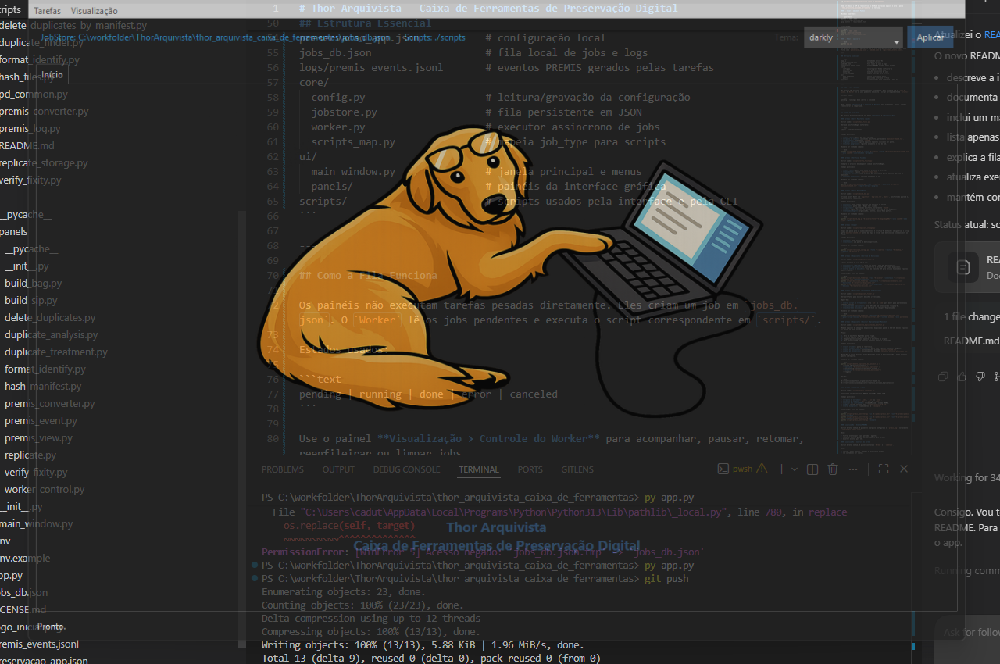

---

## Instalação Rápida

### 1. Baixar o projeto

Com Git:

```bash
git clone https://github.com/cadutd/ThorArquivista.git
cd ThorArquivista/thor_arquivista_caixa_de_ferramentas
```

Sem Git: baixe o ZIP do repositório no GitHub, extraia o arquivo e abra a pasta `thor_arquivista_caixa_de_ferramentas` no terminal.

### 2. Criar o ambiente Python

Windows PowerShell:

```powershell
python -m venv .venv
.\.venv\Scripts\Activate.ps1
pip install -r requirements.txt
```

Linux/macOS:

```bash
python -m venv .venv
source .venv/bin/activate
pip install -r requirements.txt
```

### 3. Rodar a aplicação

```bash
python app.py
```

Na primeira execução, o aplicativo usa ou cria os arquivos locais de configuração e fila, como `preservacao_app.json`, `jobs_db.json` e `logs/premis_events.jsonl`.

---

## Estrutura Essencial

```text
app.py                         # entrada da aplicação
preservacao_app.json           # configuração local
jobs_db.json                   # fila local de jobs e logs
logs/premis_events.jsonl       # eventos PREMIS gerados pelas tarefas
core/
  config.py                    # leitura/gravação da configuração
  jobstore.py                  # fila persistente em JSON
  worker.py                    # executor assíncrono de jobs
  scripts_map.py               # mapeia job_type para scripts
ui/
  main_window.py               # janela principal e menus
  panels/                      # painéis da interface gráfica
scripts/                       # scripts usados pela interface e pela CLI
tests/                         # testes automatizados e relatório HTML
```

---


## Como a Fila Funciona

Os painéis não executam tarefas pesadas diretamente. Eles criam um job em `jobs_db.json`. O `Worker` lê os jobs pendentes e executa o script correspondente em `scripts/`.

Estados usados:

```text
pending | running | done | error | canceled
```

Use o painel **Visualização > Controle do Worker** para acompanhar, pausar, retomar, reenfileirar ou limpar jobs. A lista abre com o filtro **todos** por padrão.

Para reduzir travamentos em execuções longas, o Worker agrupa linhas de log antes de gravar em `jobs_db.json`, usa escrita atômica com arquivos temporários únicos e limita o histórico mantido por job. A janela de logs atualiza incrementalmente, em vez de reconstruir todo o conteúdo a cada atualização.

---

## Manual da Interface

Os painéis disponíveis ficam nos menus **Tarefas** e **Visualização**.

### Tarefas > Gerar Manifesto (Hash)

Script usado: `scripts/hash_files.py`

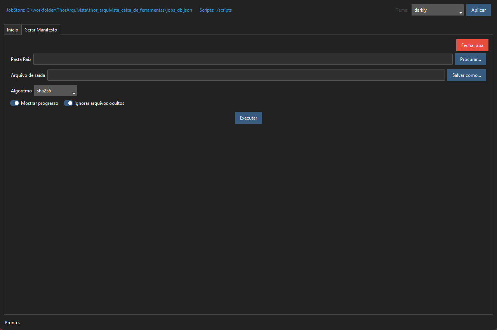

Gera um manifesto BagIt no formato:

```text
<hash>  <caminho/relativo>
```

Campos principais:

- **Pasta raiz**: pasta que será varrida.
- **Arquivo de saída**: caminho do manifesto, por exemplo `manifest-sha256.txt`.
- **Algoritmo**: normalmente `sha256`.
- **Ignorar ocultos**: ignora arquivos e pastas iniciados por ponto. A opção abre desmarcada por padrão.
- **Mostrar progresso**: registra andamento no log do job em marcos de 5%, com quantidade processada e restante.

Exemplo por linha de comando:

```bash
python scripts/hash_files.py --raiz "D:/acervo" --saida "D:/acervo/manifest-sha256.txt" --algo sha256 --ignore-hidden --progress
```

### Tarefas > Verificar Fixidez

Script usado: `scripts/verify_fixity.py`

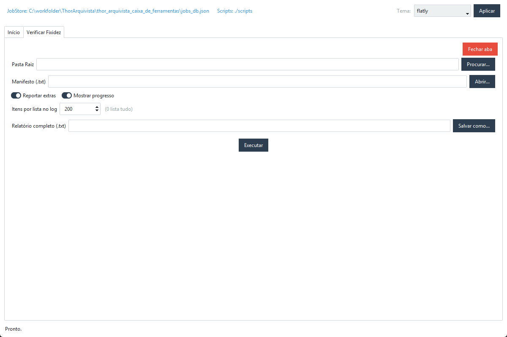

Compara os arquivos de uma pasta com um manifesto BagIt.

Campos principais:

- **Pasta raiz**: pasta onde estão os arquivos a verificar.
- **Manifesto**: arquivo `manifest-<algo>.txt`.
- **Reportar extras**: mantido por compatibilidade; o relatório final sempre lista arquivos que existem na pasta, mas não aparecem no manifesto.
- **Mostrar progresso**: registra andamento no log em marcos de 5%, com quantidade verificada e restante.

Relatório final:

- total de entradas no manifesto;
- quantidade de arquivos verificados íntegros;
- quantidade de arquivos verificados corrompidos ou com erro;
- quantidade e lista de arquivos presentes no manifesto e ausentes na pasta analisada;
- quantidade e lista de arquivos presentes na pasta analisada e ausentes no manifesto;
- tempo total de verificação e média por arquivo.

As contagens e seções são exibidas mesmo quando o valor é `0`; listas vazias aparecem como `Nenhum`.

Exemplo por linha de comando:

```bash
python scripts/verify_fixity.py --raiz "D:/acervo" --manifesto "D:/acervo/manifest-sha256.txt" --report-extras --progress
```

### Tarefas > Gerar Pacote BagIt

Script usado: `scripts/build_bag.py`

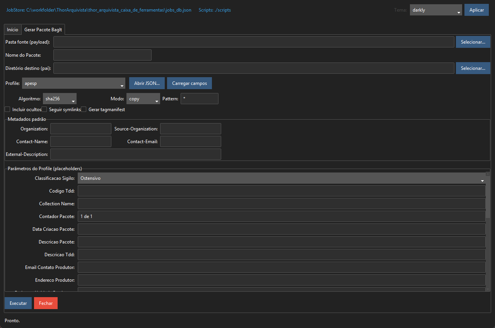

Cria um pacote BagIt com `bagit.txt`, `bag-info.txt`, `data/`, manifesto do payload e, opcionalmente, tagmanifest.

Campos principais:

- **Fonte**: pasta com os arquivos que entrarão no pacote.
- **Destino**: pasta onde o BagIt será criado.
- **Algoritmo**: algoritmo do manifesto, normalmente `sha256`.
- **Modo**: cópia, hardlink ou movimentação, conforme opções do painel.
- **Metadados BagIt**: organização, contato, descrição e profile.

Exemplo por linha de comando:

```bash
python scripts/build_bag.py "D:/acervo/fonte" "D:/bags/bag_001" --algo sha256 --mode copy --tagmanifest
```

Durante a transferência e a geração do manifesto do payload, o progresso é registrado em marcos de 5%, com resumo de tempo total e média por arquivo ao final de cada fase.

### Tarefas > Copiar

Script usado: `scripts/replicate_storage.py`

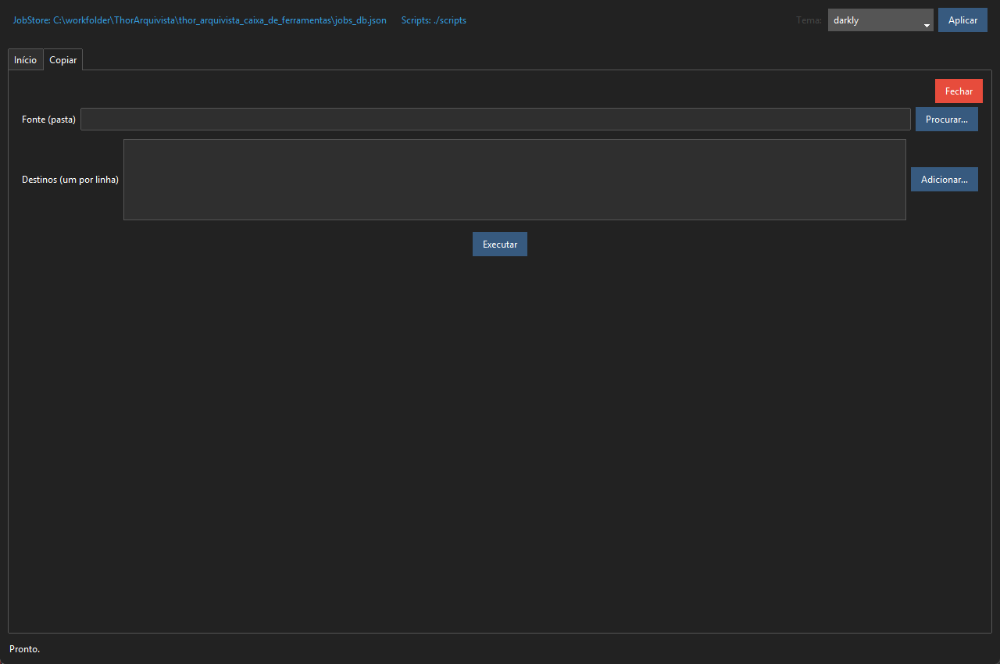

Copia uma pasta para um ou mais destinos. A verificação de hash é obrigatória: o script gera `manifest-sha256.txt` antes da cópia e valida cada destino com esse manifesto ao final.

Campos principais:

- **Fonte**: pasta original.
- **Destinos**: uma pasta de destino por linha.

Exemplo por linha de comando:

```bash
python scripts/replicate_storage.py --fonte "D:/acervo" --destino "E:/backup_1" --destino "F:/backup_2"
```

O progresso da cópia, da geração do manifesto e da verificação de fixidez é registrado em marcos de 5%, sem atualização contínua no terminal.

### Tarefas > Backup Preservacional

Script usado: `scripts/backup_plan.py`

Executa um backup preservacional incremental em um destino tratado como repositório BagIt. A fonte de verdade do backup é o manifesto BagIt do destino; não há uso de banco SQL.

Campos e ações principais:

- **Plano JSON**: arquivo que define nome, destino, opções e origens.
- **Destino BagIt**: pasta do repositório de backup.
- **Backup**: nome lógico usado em checkpoints e histórico.
- **Validar plano**: confere estrutura mínima e existência das origens.
- **Executar**: enfileira o job `BACKUP_PLAN`.
- **Retomar**: retoma pelo checkpoint e remove `STOP` quando necessário.
- **Pausar com STOP**: cria `thor-backup/checkpoints/STOP` para parada segura.
- **Verificar integridade**: enfileira `BACKUP_VERIFY`.
- **Histórico**: lista checkpoints, relatórios e manifestos históricos.

As etapas de geração de manifesto de origem e aplicação incremental do backup registram progresso em marcos de 5%, com quantidade restante e resumo de duração.

Exemplo por linha de comando:

```bash
python scripts/backup_plan.py --config "D:/planos/backup.json" --progress
python scripts/backup_plan.py --resume --config "D:/planos/backup.json"
python scripts/backup_verify.py --destino "E:/Backup" --progress
```

Estrutura criada no destino:

```text
Backup/
  data/
  manifest-sha256.txt
  tagmanifest-sha256.txt
  bag-info.txt
  bagit.txt
  thor-backup/
    configs/
    manifests/origem/
    manifests/destino/
    manifests/historico/
    checkpoints/
    relatorios/
    logs/
    versoes/
```

### Tarefas > Editar Plano de Backup

Tela separada para criar e editar o arquivo JSON usado pelo backup preservacional.

Funcionalidades:

- criar plano novo;
- abrir plano existente;
- editar nome do backup, destino BagIt, algoritmo e opções;
- adicionar, editar e remover origens;
- pré-visualizar JSON;
- validar campos obrigatórios;
- salvar ou salvar como `.json`.

Exemplo de plano:

```json
{
  "name": "acervo_institucional",
  "destination": "E:/Backup",
  "sources": [
    {"name": "documentos", "path": "D:/Acervo/Documentos"},
    {"name": "imagens", "path": "D:/Acervo/Imagens"}
  ],
  "options": {
    "algo": "sha256",
    "ignore_hidden": true,
    "follow_symlinks": false
  }
}
```

### Tarefas > Duplicatas > Análise de Duplicatas

Script usado: `scripts/duplicate_finder.py`

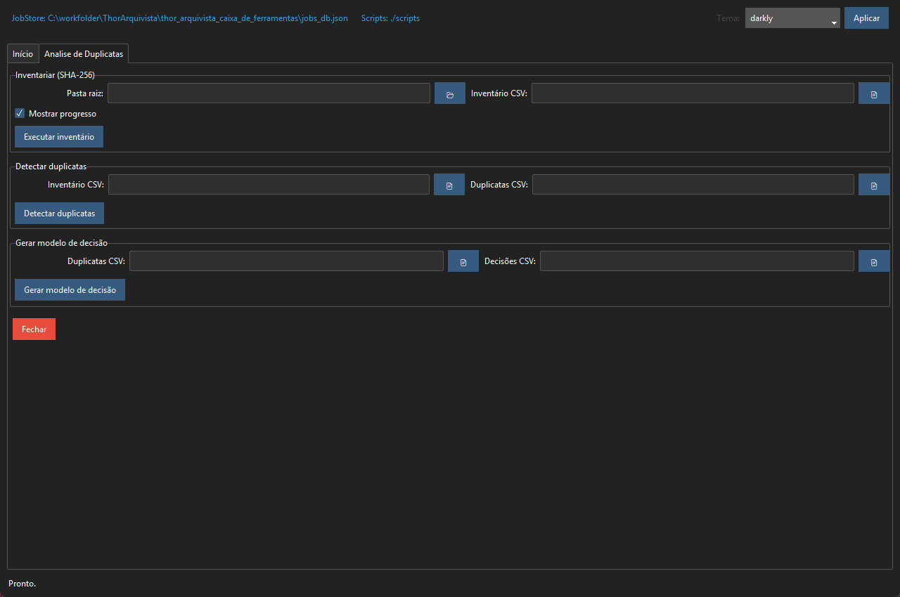

Painel dividido em três operações:

- **Inventariar (SHA-256)**: varre uma pasta e gera CSV de inventário.
- **Detectar duplicatas**: lê o inventário e gera CSV com grupos duplicados.
- **Gerar modelo de decisão**: cria uma planilha CSV para revisão humana dos arquivos a manter/remover.

Exemplos por linha de comando:

```bash
python scripts/duplicate_finder.py --raiz "D:/acervo" --inventario "D:/relatorios/inventario.csv" --mostrar-progresso
python scripts/duplicate_finder.py --inventario "D:/relatorios/inventario.csv" --duplicatas "D:/relatorios/duplicatas.csv"
python scripts/duplicate_finder.py --from-duplicatas "D:/relatorios/duplicatas.csv" --decisoes "D:/relatorios/decisoes.csv"
```

Quando **Mostrar progresso** está habilitado, o inventário registra total inicial, marcos de 5%, quantidade restante e resumo de duração.

### Tarefas > Duplicatas > Tratamento de Duplicatas

Script usado: `scripts/duplicate_finder.py`

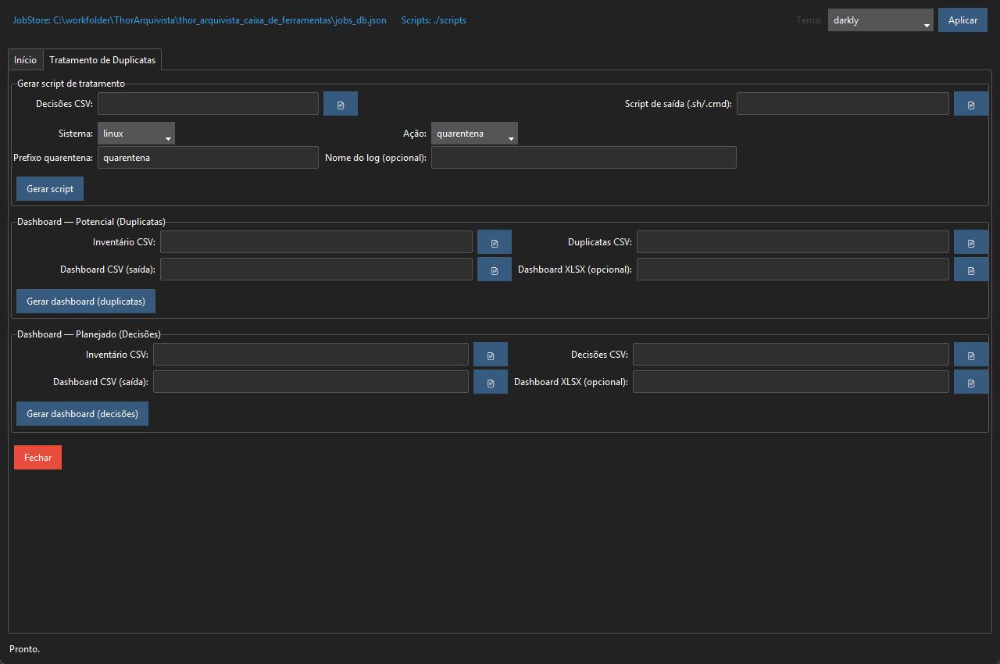

Gera artefatos para executar decisões já revisadas.

Operações:

- **Gerar script de tratamento**: cria `.sh` ou `.cmd` para mover para quarentena ou remover arquivos.
- **Dashboard de duplicatas**: gera CSV/XLSX com potencial de recuperação.
- **Dashboard de decisões**: gera CSV/XLSX com recuperação planejada.

Exemplo por linha de comando:

```bash
python scripts/duplicate_finder.py --decisoes "D:/relatorios/decisoes.csv" --gerar-script-remocao "D:/relatorios/tratar.cmd" --sistema windows --acao quarentena
```

### Tarefas > Duplicatas > Excluir Duplicatas por Manifesto

Script usado: `scripts/delete_duplicates_by_manifest.py`

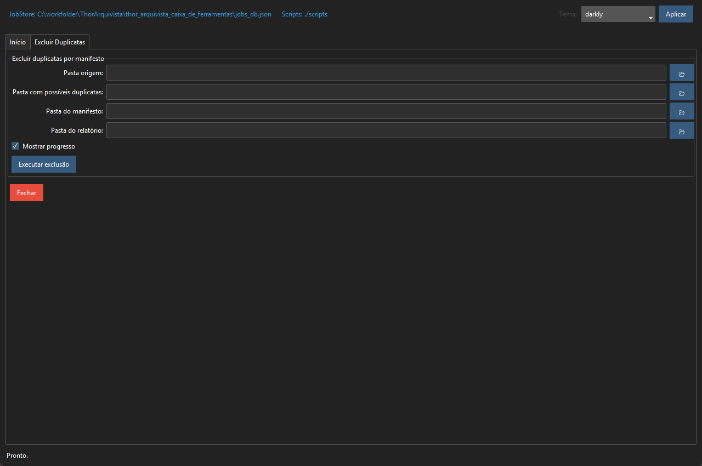

Remove arquivos de uma pasta de possíveis duplicatas quando o SHA-256 desses arquivos já existe na pasta origem.

Fluxo:

1. Gera um manifesto BagIt da pasta origem.
2. Percorre a pasta com possíveis duplicatas.
3. Apaga arquivos cujo hash aparece no manifesto da origem.
4. Gera relatório CSV com arquivos apagados e espaço recuperado.

Com progresso habilitado, a geração do manifesto e a verificação/exclusão também usam marcos de 5% e resumo de duração.

Campos principais:

- **Pasta origem**: pasta de referência.
- **Pasta com possíveis duplicatas**: pasta onde arquivos podem ser apagados.
- **Pasta do manifesto**: pasta onde será gravado `manifest-sha256.txt`.
- **Pasta do relatório**: pasta onde será gravado `relatorio_exclusao_duplicatas.csv`.

Proteção: o script bloqueia execução quando origem e duplicatas são a mesma pasta ou pastas sobrepostas.

Exemplo por linha de comando:

```bash
python scripts/delete_duplicates_by_manifest.py \
  --origem "D:/acervo/originais" \
  --duplicatas "D:/acervo/possiveis_duplicatas" \
  --manifesto "D:/relatorios/manifesto_origem" \
  --relatorio "D:/relatorios/exclusao_duplicatas" \
  --progress
```

Saídas:

```text
D:/relatorios/manifesto_origem/manifest-sha256.txt
D:/relatorios/exclusao_duplicatas/relatorio_exclusao_duplicatas.csv
```

### Tarefas > Conversor Premis

Script usado: `scripts/premis_converter.py`

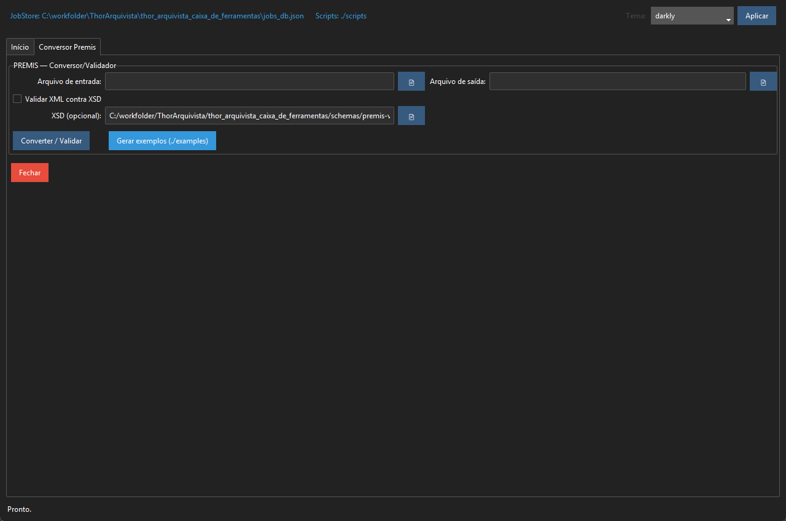

Converte e valida registros PREMIS entre XML, CSV e JSON.

Campos principais:

- **Arquivo de entrada**: `.xml`, `.csv` ou `.json`.
- **Arquivo de saída**: `.xml`, `.csv` ou `.json`.
- **Validar XML contra XSD**: valida XML com o schema PREMIS.
- **XSD**: caminho opcional para `schemas/premis-v3-0.xsd`.
- **Gerar exemplos**: cria exemplos em `./examples`.

Exemplos por linha de comando:

```bash
python scripts/premis_converter.py --in "D:/premis/premis.xml" --out "D:/premis/premis.csv" --validate
python scripts/premis_converter.py --in "D:/premis/premis.csv" --out "D:/premis/premis.xml" --schema "schemas/premis-v3-0.xsd"
python scripts/premis_converter.py --example
```

### Visualização > Eventos PREMIS

Script direto: nenhum. O painel lê o arquivo configurado em `premis_log`, normalmente `logs/premis_events.jsonl`.

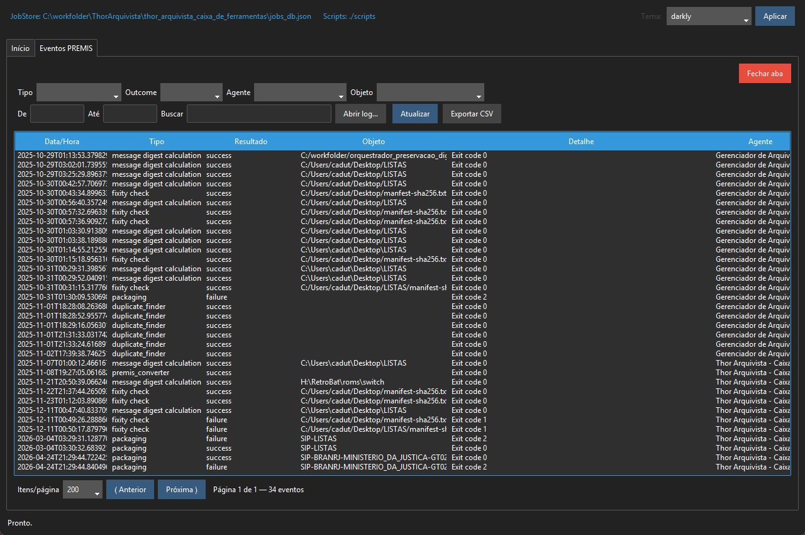

Uso:

- filtrar eventos por tipo, período e agente;
- consultar eventos gerados automaticamente pelo Worker;
- exportar eventos para CSV.

### Visualização > Controle do Worker

Script direto: nenhum. O painel controla o `Worker` e o `JobStore`.

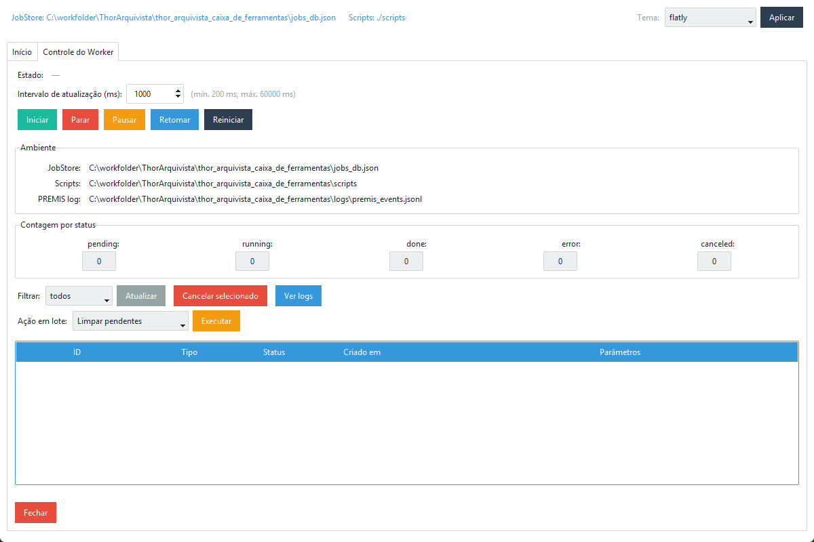

Uso:

- iniciar, parar, pausar, retomar e reiniciar o worker;
- ver contadores por status;
- listar jobs por status; o filtro inicial é **todos**;
- cancelar jobs pendentes;
- reenfileirar jobs com erro, concluídos ou cancelados;
- limpar jobs pendentes, concluídos ou com erro;
- abrir logs detalhados de cada job;
- copiar logs para a área de transferência;
- exportar o conteúdo atual da janela de logs para um arquivo `.txt`.

A janela de logs faz auto-refresh incremental e usa intervalo mínimo de 5 segundos para reduzir leitura de disco e evitar travamentos em execuções longas.

Ao tentar fechar o sistema, se houver job em execução, a janela principal mostra uma confirmação de encerramento com o tipo e o id do job em processamento.

---

## Scripts Disponíveis Pela Interface

A interface gráfica usa estes scripts:

| Painel | Script |
|---|---|
| Gerar Manifesto (Hash) | `scripts/hash_files.py` |
| Verificar Fixidez | `scripts/verify_fixity.py` |
| Gerar Pacote BagIt | `scripts/build_bag.py` |
| Copiar | `scripts/replicate_storage.py` |
| Backup Preservacional | `scripts/backup_plan.py` |
| Backup Preservacional > Verificar integridade | `scripts/backup_verify.py` |
| Editar Plano de Backup | nenhum script direto; cria/edita JSON |
| Análise de Duplicatas | `scripts/duplicate_finder.py` |
| Tratamento de Duplicatas | `scripts/duplicate_finder.py` |
| Excluir Duplicatas por Manifesto | `scripts/delete_duplicates_by_manifest.py` |
| Conversor Premis | `scripts/premis_converter.py` |

Outros scripts ou módulos podem existir no repositório como suporte interno, legado ou desenvolvimento, mas este README documenta apenas o que aparece na interface gráfica atual.

---

## Testes

A suíte de testes cobre:

- criação e edição do plano JSON de backup;
- montagem das telas de Backup Preservacional e Editar Plano de Backup com widgets simulados;
- geração de manifestos;
- comparação `new`, `changed`, `same` e `removed`;
- execução inicial e incremental do backup;
- versionamento;
- preservação de removidos;
- parada segura por `STOP` e retomada;
- verificação de fixidez, relatório final de íntegros/corrompidos/faltantes/extras e evento PREMIS `FIXITY_CHECK`;
- concorrência e contenção de logs do `JobStore`.

Execute a suíte e gere o relatório HTML:

```powershell
py tests\run_backup_tests_html.py
```

Saída principal:

```text
tests/reports/backup_tests_report.html
```

O relatório lista cada teste executado com finalidade, pré-condições, pós-condições, status, duração e detalhes.

---

## Configuração

Arquivo principal: `preservacao_app.json`.

Exemplo:

```json
{
  "scripts_dir": "./scripts",
  "logs_dir": "./logs",
  "premis_log": "./logs/premis_events.jsonl",
  "premis_agent": "Thor Arquivista - Caixa de Ferramentas de Preservação Digital v1.0",
  "jobstore_path": "./jobs_db.json",
  "ui_theme": "flatly"
}
```

Campos:

- `scripts_dir`: pasta dos scripts chamados pelo Worker.
- `logs_dir`: pasta padrão de logs.
- `premis_log`: arquivo JSONL de eventos PREMIS.
- `premis_agent`: agente registrado nos eventos PREMIS.
- `jobstore_path`: arquivo JSON da fila.
- `ui_theme`: tema inicial do `ttkbootstrap`.

---

## Boas Práticas

- Use `sha256` como padrão para fixidez e duplicatas.
- Antes de excluir duplicatas em acervos reais, rode em uma cópia de teste.
- Guarde os relatórios CSV junto com a documentação do processamento.
- Evite usar uma pasta de destino dentro da pasta de origem.
- Caminhos com espaços devem ficar entre aspas na linha de comando.
- Em Windows, os comandos aceitam `\`, mas os manifestos BagIt gravam caminhos relativos com `/`.

---

## Solução de Problemas

**O app não abre**

Confira se o ambiente virtual está ativo e se as dependências foram instaladas:

```bash
pip install -r requirements.txt
python app.py
```

**O Worker parece parado**

Abra **Visualização > Controle do Worker** e use **Iniciar** ou **Reiniciar**.

**Um job ficou com erro**

Abra os logs no painel **Controle do Worker**. O erro do script geralmente aparece em `stderr` dentro dos logs do job.

**Preciso guardar os logs de um job**

Abra **Visualização > Controle do Worker**, selecione o job, clique em **Ver logs** e use **Exportar TXT**.

**A tela abre fora do centro**

A janela é centralizada depois da montagem inicial, usando a área útil do monitor ativo no Windows. Se usar múltiplos monitores, deixe o cursor no monitor desejado ao abrir o aplicativo.

**Erro de permissão**

Execute o aplicativo em uma pasta onde o usuário tenha permissão de leitura e escrita. As tarefas criam manifestos, relatórios, logs e arquivos temporários.

---

## Licença

Este projeto é licenciado sob a **GNU General Public License v3.0 (GPLv3)**.

© 2025 Carlos Eduardo Carvalho Amand.

Mais informações: [https://www.gnu.org/licenses/gpl-3.0.html](https://www.gnu.org/licenses/gpl-3.0.html)
